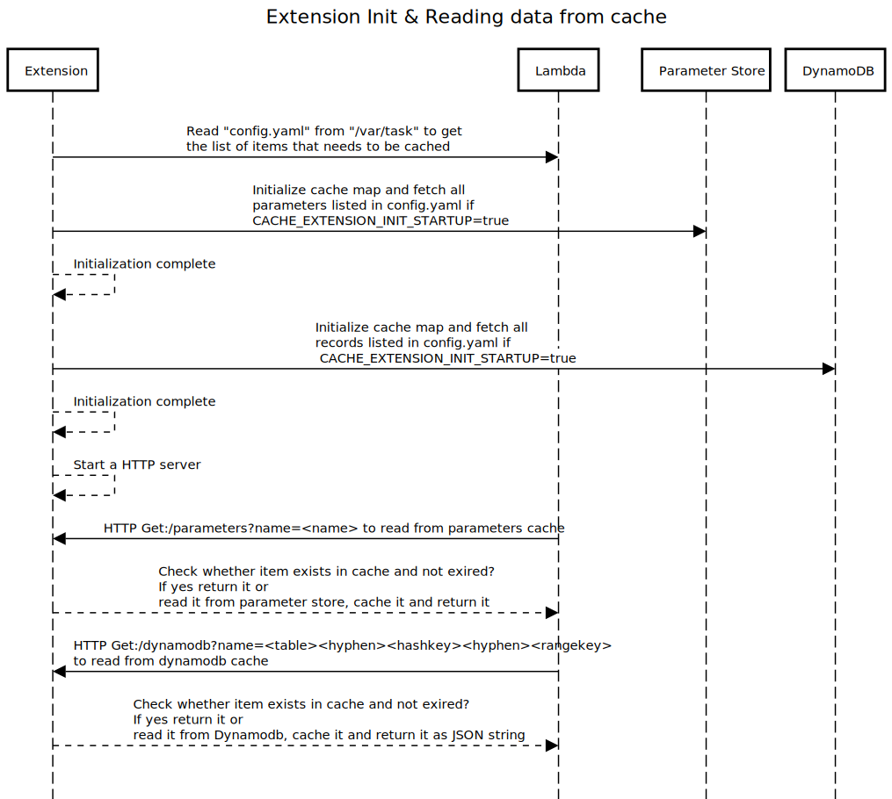

# Cache Extension Demo in Go

The provided code sample demo's a cache extension written in Go that acts as a companion process which the AWS Lambda function runtime can communicate.

# Introduction
Having a caching layer inside the Lambda function is a very common use case. It would allow the lambda function to process requests quicker and avoid the additional cost incurred by calling the AWS services over and over again. They are two types of cache:
- Data cache (caching data from databases like RDS, dynamodb, etc.)
- Configuration cache (caching data from a configuration system like parameter store, app config, secrets, etc.)

This extension demo's the Lambda layer that enables both data cache (using dynamodb) and configuration cache (using parameter store).
Here is how it works:
- Uses `config.yaml` defined part of the lambda function to determine the items that needs to be cached
- All the data are cached in memory before the request gets handled to the lambda function. So no cold start problems
- Starts a local HTTP server at port `3000` that replies to request for reading items from the cache depending upon path variables
- Uses `"CACHE_EXTENSION_TTL"` Lambda environment variable to let users define cache refresh interval (defined based on Go time format, ex: 30s, 3m, etc)
- Uses `"CACHE_EXTENSION_INIT_STARTUP"` Lambda environment variable used to specify whether to load all items specified in `"cache.yml"` into cache part of extension startup (takes boolean value, ex: true and false)

Here are some advantages of having the cache layer part of Lambda extension instead of having it inside the function
- Reuse the code related to cache in multiple Lambda functions
- Common dependencies like SDK are packaged part of the Lambda layers

## Architecture
Here is the high level view of all the components


## Initialize extension and reading secrets from the cache
Below sequence diagram explains the initialization of lambda extension and how lambda function
reads cached items using HTTP server hosted inside the extension


## Pre-requisites
- Zip utility needs to be installed in the local system
- AWS CLI needs to be installed in the local system, for more information click [here](https://docs.aws.amazon.com/cli/latest/userguide/cli-chap-install.html)

## Deploy

One can quickly deploy the extension using SAM or using AWS CLI 

### Option 1: SAM 

In this SAM Deployment, we create a sample DynamoDB Table, and a sample Lambda function with the cache extensions attached as a layer. Lambda Extension is a Go executable, so it can be easily imported in any lambda function as a Layer. If you are new to SAM, you can quickly install SAM. Once you have SAM, Cache extension deployment involves two simple steps:

First, we build all the dependencies   
```
cd SAM/ 
sam build
```
Once the build is succesful, deploy the template using  
```
sam deploy

```
### Option 2: AWS CLI 

### Parameter Store
Create a new parameter using the following command

```bash
aws ssm put-parameter \
    --name "Parameter1" \
    --type "String" \
    --value "Parameter_value"
```

### DynamoDB
- Create a new dynamodb table with a partition key compassing of hash and sort key

```bash
aws dynamodb create-table \
    --table-name DynamoDbTable \
    --attribute-definitions AttributeName=pKey,AttributeType=S AttributeName=sKey,AttributeType=S \
    --key-schema AttributeName=pKey,KeyType=HASH AttributeName=sKey,KeyType=RANGE \
    --billing-mode PAY_PER_REQUEST
```
- Save the following JSON in a file named as `"item.json"`

```json
{
    "pKey": {"S": "pKey1"},
    "sKey": {"S": "sKey1"},
    "Data": {"S": "Data goes here"}
} 
``` 

- Add a new record to the `DynamoDbTable` table, by running the following command
```bash
aws dynamodb put-item \
    --table-name DynamoDbTable \
    --item file://item.json \
    --return-consumed-capacity TOTAL \
    --return-item-collection-metrics SIZE
```

## Compile package and dependencies
To run this example, you will need to ensure that your build architecture matches that of the Lambda execution environment by compiling with `GOOS=linux` and `GOARCH=amd64` if you are not running in a Linux environment.

Building and saving package into a `bin/extensions` directory:
```bash
$ cd cache-extension-demo
$ GOOS=linux GOARCH=amd64 go build -o bin/extensions/cache-extension-demo main.go
$ chmod +x bin/extensions/cache-extension-demo
```

## Layer Setup Process
The extensions .zip file should contain a root directory called `extensions/`, where the extension executables are located. In this sample project we must include the `cache-extension-demo` binary.

Creating zip package for the extension:
```bash
$ cd bin
$ zip -r extension.zip extensions/
```

Ensure that you have aws-cli v2 for the commands below.
Publish a new layer using the `extension.zip`. The output of the following command should provide you a layer arn.
```bash
aws lambda publish-layer-version \
    --layer-name "cache-extension-demo" \
    --region <use your region> \
    --zip-file  "fileb://extension.zip"
```
Note the LayerVersionArn that is produced in the output.
eg. `"LayerVersionArn": "arn:aws:lambda:<region>:123456789012:layer:<layerName>:1"`

Add the newly created layer version to a Lambda function.
- You can use the provided `index.js` (nodeJS extension) in the `example/` directory
- Make sure to have a `config.yaml` in the root of the lambda function's directory and updated with the correct region information. You can use the provided `config.yaml` in the the `example/` directory
- Make sure to increase the default timeout to 2 mins and memory to 512 MB

>Note: Make sure to have`'AmazonDynamoDBReadOnlyAccess'` & `'AmazonSSMReadOnlyAccess'` IAM policies assigned to the IAM role associated with the Lambda function

Here is the AWS CLI command that can update the layers on the existing AWS Lambda function

```bash
aws lambda update-function-configuration \
  --function-name <<function-name>> \
  --layers $(aws lambda list-layer-versions --layer-name cache-extension-demo \
  --max-items 1 --no-paginate --query 'LayerVersions[0].LayerVersionArn' \
  --output text)
```

>Note: Make sure to replace `function-name` with the actual lambda function name

## Function Invocation and Extension Execution
You can invoke the Lambda function using the following CLI command
```bash
aws lambda invoke \
    --function-name "<<function-name>>" \
    --payload '{"payload": "hello"}' /tmp/invoke-result \
    --cli-binary-format raw-in-base64-out \
    --log-type Tail
```
>Note: Make sure to replace `function-name` with the actual lambda function name

The function should return ```"StatusCode": 200```.

When invoking the function, you should now see log messages from the example extension similar to the following:
```    
XXXX-XX-XXTXX:XX:XX.XXX-XX:XX    START RequestId: 9ca08945-de9b-46ec-adc6-3fe9ef0d2e8d Version: $LATEST    
XXXX-XX-XXTXX:XX:XX.XXX-XX:XX    [cache-extension-demo]  Register response: {
                                        "functionName": "my-function",
                                        "functionVersion": "$LATEST",
                                        "handler": "function.handler"
                                }
XXXX-XX-XXTXX:XX:XX.XXX-XX:XX    [cache-extension-demo]  Cache successfully loaded
XXXX-XX-XXTXX:XX:XX.XXX-XX:XX    [cache-extension-demo]  Waiting for event...
XXXX-XX-XXTXX:XX:XX.XXX-XX:XX    [cache-extension-demo]  Starting Httpserver on port 3000
XXXX-XX-XXTXX:XX:XX.XXX-XX:XX    EXTENSION Name: cache-extension-demo State: Ready Events: [INVOKE,SHUTDOWN]        
...
...
Function logs...
...
...
XXXX-XX-XXTXX:XX:XX.XXX-XX:XX    START RequestId: d94434eb-705d-4c22-8600-c7f53a0c2204 Version: $LATEST
XXXX-XX-XXTXX:XX:XX.XXX-XX:XX    [cache-extension-demo] Waiting for event...
XXXX-XX-XXTXX:XX:XX.XXX-XX:XX    INFO	Finally got some response here: "{\"Data\":\"Data goes here\",\"pKey\":\"pKey1\",\"sKey\":\"sKey1\"}"
XXXX-XX-XXTXX:XX:XX.XXX-XX:XX    END RequestId: d94434eb-705d-4c22-8600-c7f53a0c2204
XXXX-XX-XXTXX:XX:XX.XXX-XX:XX    REPORT RequestId: d94434eb-705d-4c22-8600-c7f53a0c2204	Duration: 17.09 ms	Billed Duration: 18 ms	Memory Size: 1472 MB	Max Memory Used: 89 MB	Init Duration: 289.40 ms	
```
