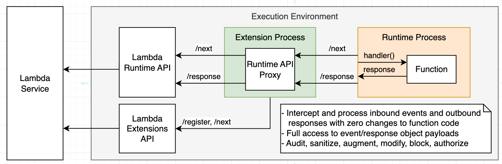
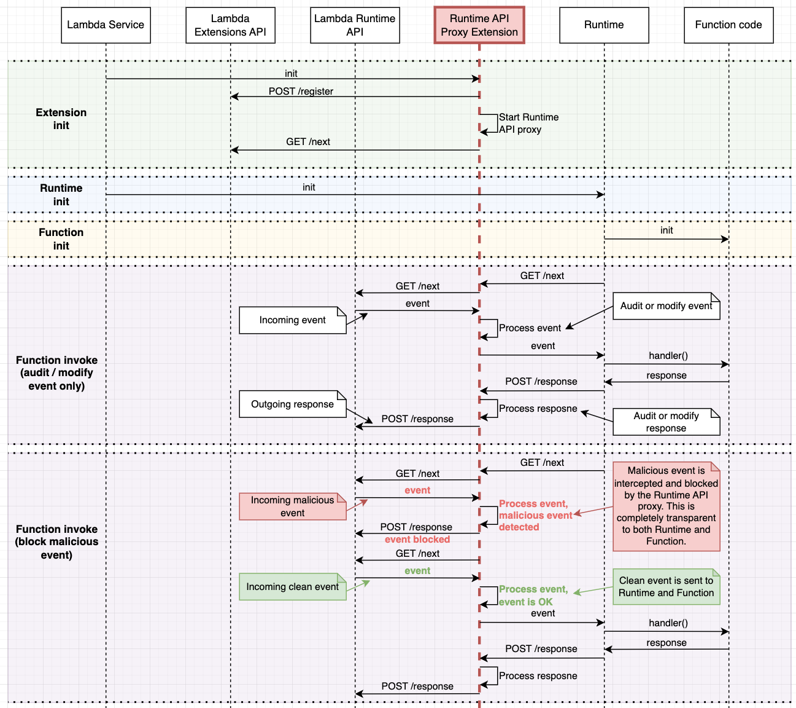

# Sample Lambda Runtime API Proxy Extension in Golang

This repo demonstrates a sample of how to build a basic Lambda Runtime API Proxy extension with Golang.

> This is a simple example to help you start investigating the Lambda Runtime API Proxy approach. This sample code is not production ready. Use it at your own discretion after testing thoroughly.

By implementing a Runtime API proxy as part of your extension, you can hook into the function invocation request and response lifecycle. This allows you to use extensions for implementing advanced observability, security, compliance, and governance scenarios with zero changes to the function code. You can add runtime security mechanisms, such as application firewalls, implement audit procedures for data flowing in and out of the function, enhance observability by auto-injecting tracing headers, and more.

## Architecture

Lambda Runtimes use the `AWS_LAMBDA_RUNTIME_API` environment variable for making the Runtime API requests. Two primary endpoints for the happy path scenario are `/next`, which is used to retrieve the next event to process, and `/response`, which is used to return event processing results to the Lambda service. In addition, the Lambda Runtime API also provides endpoints for reporting failures. See the full protocol and schema definitions of the Runtime API [here](https://docs.aws.amazon.com/lambda/latest/dg/runtimes-api.html).

The Runtime API Proxy is a component that hooks into the default workflow, and proxies requests and responses, allowing you to augment them and control the workflow along the path. This is illustrated in the following diagram.



## Sequence diagram

When Lambda service creates a new Execution Environment, it starts by initializing extensions attached to the function. The Execution Environment waits for all extensions to report initialization success by calling the Extensions API `/register` endpoint, and only then proceeds to initialize the Runtime. This allows you to start the Runtime API Proxy HTTP listener during extension initialization so it will be ready to serve the Runtime requests.

By default, the value of `AWS_LAMBDA_RUNTIME_API` environment variable in the Runtime process points to the Lambda Runtime API endpoint 127.0.0.1:9000. You can use a simple wrapper script to change that value to point to the Runtime API Proxy endpoint instead. You can add a wrapper script to your function by setting the `AWS_LAMBDA_EXEC_WRAPPER`` environment variable. The following wrapper script assumes that the Runtime API Proxy is listening on port 9009.

```bash
#!/bin/bash
args=("$@")
export AWS_LAMBDA_RUNTIME_API="127.0.0.1:9009"
exec "${args[@]}"
```

You can either add the above export line to the existing wrapper script or create a new one. Read more about using wrapper scripts here.

After following the above steps, the Runtime API Proxy will be bootstrapped by the Lambda service when a new Execution Environment is created and will be ready to proxy requests from the Runtime to Runtime API by first invocation. The only thing left to do is to implement the proxy logic.



We recommend you implement extensions using a programming language that can be compiled to a binary executable, such as Golang or Rust. This will allow your extension to be usable with any Lambda Runtime. Extensions implemented in interpreted languages, such as JavaScript and Python, or languages that require additional virtual machines, such as Java and C#, will only be usable with that specific runtime. Sample implementations in JavaScript, Golang, and Rust are available at http://github.com/aws-samples/.

## Considerations

Runtime API Proxy allows you to hook into the Lambda request/response workflow, enabling new use cases in security and observability space. However, there are several important considerations when using it.

-   This is a technically advanced approach that will require you to have a good understanding of Lambda Execution environment lifecycle and Runtime API specifics. You will need to implement proxying for all the endpoints provided by the Runtime API, as well as handle runtime failures.
-   You should prepare your extension for composability, and always assume there might be more than one extension implementing the Runtime API Proxy pattern. Allow your extension consumers to configure the extension via environment variables using at least two parameters - the port your extension listens on and the Runtime API endpoint your extension connects to. The latter should default to the original value of `AWS_LAMBDA_RUNTIME_API` environment variable. See the sample implementation for details.
-   Using this approach with default buffered responses is straightforward, however it will require additional effort to support functions with response streaming.
-   Proxying API requests adds latency. The added overhead depends on your implementation. We recommend using programming languages that can be compiled to executable binary, such as Rust and Golang, and keeping your extensions as lightweight and efficient as possible.

## Building the package and dependencies

Build your Golang executable matching the target lambda architecture.

```bash
export targetArch=amd64
# export targetArch=arm64

# build binary
GOOS=linux GOARCH=$(targetArch) go build -o $(ARTIFACTS_DIR)/extensions/golang-example-lambda-runtime-api-proxy-extension src/main.go

# copy the wrapper script
cp -R wrapper-script.sh $(ARTIFACTS_DIR)

# make binary and wrapper script executable
chmod +x $(ARTIFACTS_DIR)/extensions/golang-example-lambda-runtime-api-proxy-extension
chmod +x $(ARTIFACTS_DIR)/wrapper-script.sh

# create zip file
zip -r $(ARTIFACTS_DIR)/extension.zip $(ARTIFACTS_DIR)/wrapper-script.sh
zip -r $(ARTIFACTS_DIR)/extension.zip $(ARTIFACTS_DIR)/extensions
```

## Layer Setup Process

Publish a new layer using the `extension.zip` using below command. The output should provide you with a layer ARN.

```bash
aws lambda publish-layer-version \
    --layer-name "golang-example-lambda-runtime-api-proxy-extension-layer" \
    --zip-file  "fileb://extension.zip"
```

Note the `LayerVersionArn` that is produced in the output. eg.

```
LayerVersionArn: arn:aws:lambda:<region>:123456789012:layer:<layerName>:1
```

Add the newly created layer version to your Lambda function. Because we are using a compiled binary this extension will work with any Lambda runtime.

```bash
aws lambda update-function-configuration
    --function-name <your function name>
    --layers <layer arn>
```

## Function Invocation and Extension Execution

Enable the wrapper script by setting the value of `AWS_LAMBDA_EXEC_WRAPPER` environment variable to `/opt/wrapper-script.sh`.
