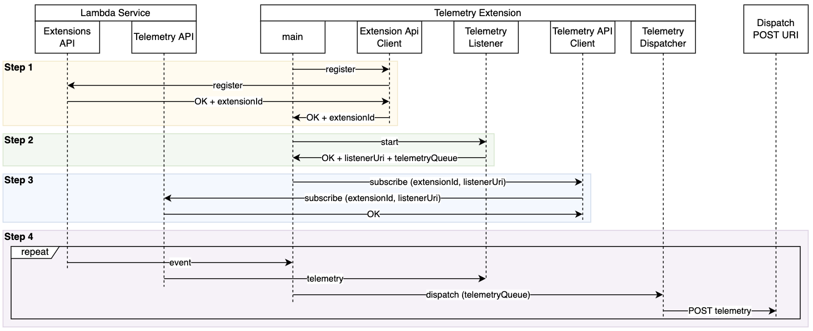

# Example Telemetry API Extension in Go

The provided code sample demonstrates how to get a basic Telemetry API extension written in Go up and running.

> This is a simple example extension to help you start investigating the Lambda Telemetry API. This example code is not production ready. Use it with your own discretion after testing thoroughly.

This sample extension: 
1. Registers the extension with Lambda Extensions API (see `extensionApi/client.go`)
2. Starts a local HTTP server to receive incoming telemetry events from the Telemetry API (see `telemetryApi/listener.go`)
3. Subscribes to the Telemetry API to start receiving incoming telemetry events (see `telemetryApi/client.go`)
4. Receives telemetry events, batches them, and dispatches to a pre-defined URI via POST requests (see `telemetryApi/dispatcher.go`)



Note that step 4 is asynchronous in nature. The functions is thawed to process the incoming event, and new telemetry might arrive either before or after dispatching existing telemetry. In case of the latter, the newly arrived telemetry will be kept in the telemetry queue and dispatched when processing next event. Depending on buffering configuration you pass to the Telemetry API during subscription, you might get either zero, one, or multiple requests from Telemetry API to the telemetry listener in a single function invocation. 

The code is heavily instrumented with logs so you'll be able to see the Telemetry API extension lifecycle messages as you're learning to implement one. 

## Build package and dependencies

To run this example, you will need to ensure that your build architecture matches that of the Lambda execution environment by compiling with `GOOS=linux` and `GOARCH=amd64` if you are not running in a Linux environment.

Building and saving package into a `bin/extensions` directory:
```bash
$ cd go-example-logs-api-extension
$ GOOS=linux GOARCH=amd64 go build -o bin/extensions/go-example-logs-api-extension main.go
$ chmod +x bin/extensions/go-example-logs-api-extension
```

## Layer Setup Process
The extensions .zip file should contain a root directory called `extensions/`, where the extension executables are located. In this sample project we must include the `go-example-telemetry-api-extension` binary.

Creating zip package for the extension:
```bash
$ cd bin
$ zip -r extension.zip extensions/
```

Publish a new layer using the `extension.zip` using below command. The output should provide you with a layer ARN. 

```bash
aws lambda publish-layer-version \
    --layer-name "go-example-telemetry-api-extension" \
    --zip-file  "fileb://extension.zip"
```

Note the `LayerVersionArn` that is produced in the output. eg. 

```
LayerVersionArn: arn:aws:lambda:<region>:123456789012:layer:<layerName>:1
```

Add the newly created layer version to a Lambda function.

```bash
aws lambda update-function-configuration 
    --function-name <your function name> 
    --layers <layer arn>
```

## Function Invocation and Extension Execution

Configure the extension by setting below environment variables

* `DISPATCH_POST_URI` - the URI you want telemetry to be posted to. If not specified you will still be able to observe extension work via produced logs in CloudWatch, but telemetry will be discarded. 
* `DISPATCH_MIN_BATCH_SIZE` - optimize dispatching telemetry by telling the dispatcher how many log events you want it to batch. On function invoke the telemetry will be dispatched to `DISPATCH_POST_URI` only if number of log events collected so far is greater than `DISPATCH_MIN_BATCH_SIZE`. On function shutdown the telemetry will be dispatched to `DISPATCH_POST_URI` regardless of how many log events were collected so far. 

