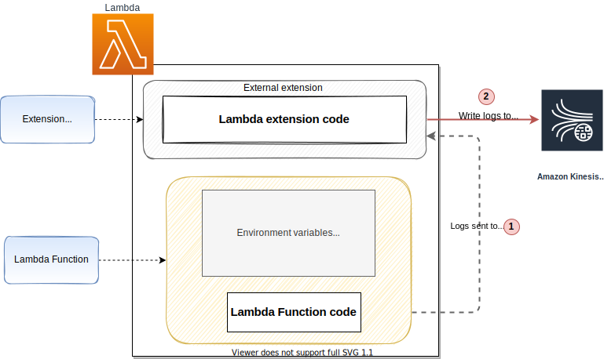

# Centralize log collection with Amazon Kinesis Data Streams using Lambda Extensions

## Introduction

This example show how to centralize log collection for a Lambda function using Kinesis Data Streams. The provided code sample uses Lambda extensions to receive logs from Lambda and send them directly to Kinesis Data Streams without sending them to Amazon CloudWatch service.

> Note: This is a simple example extension to help you investigate an approach to centralize the log aggregation. This example code is not production ready. Use it with your own discretion after testing thoroughly.

This sample extension:

* Subscribes to receive `platform` and `function` logs.
* Runs with a main, and a helper goroutine: The main goroutine registers to `ExtensionAPI` and process its `invoke` and `shutdown` events. The helper goroutine:
  * starts a local HTTP server at the provided port (default 1234, the port can be overridden with Lambda environment variable `HTTP_LOGS_LISTENER_PORT` ) that receives requests from Logs API with `NextEvent` method call
  * puts the logs in a synchronized queue (Producer) to be processed by the main goroutine (Consumer)
* The main goroutine writes the received logs to Amazon Kinesis Data Streams.

## Amazon Kinesis Data Streams

Amazon Kinesis Data Streams is a serverless streaming data service that makes it easy to capture, process, and store data streams at any scale, read more about it [here](https://aws.amazon.com/kinesis/data-streams/)

## Lambda extensions

Lambda Extensions, a new way to easily integrate Lambda with your favorite monitoring, observability, security, and governance tools. Extensions are a new way for tools to integrate deeply into the Lambda environment. There is no complex installation or configuration, and this simplified experience makes it easier for you to use your preferred tools across your application portfolio today. You can use extensions for use-cases such as:

* capturing diagnostic information before, during, and after function invocation
* automatically instrumenting your code without needing code changes
* fetching configuration settings or secrets before the function invocation
* detecting and alerting on function activity through hardened security agents, which can run as separate processes from the function

read more about it [here](https://aws.amazon.com/blogs/compute/introducing-aws-lambda-extensions-in-preview/)

> Note: The code sample provided part of this pattern uses **external** extension to listen to log events from the Lambda function

## Need to centralize log collection

Having a centralized log collecting mechanism using Kinesis Data Streams provides the following benefits:

* Helps to collect logs from different sources in one place. Even though the sample provided sends logs from Lambda, log routers like `Fluentbit` and `Firelens` can send logs directly to Kinesis Data Streams from container orchestrators like ["Amazon Elastic Kubernetes Service (EKS)"](https://aws.amazon.com/eks) and ["Amazon Elastic Container Service (ECS)"](https://aws.amazon.com/ecs)
* Provides a secure storage area for log data, before it can forwarded to a different destination.

## Architecture

### AWS Services

* AWS Lambda
* AWS Lambda extension
* Amazon Kinesis Data Streams

### High level architecture

Here is the high level view of all the components



Once deployed the overall flow looks like below:

* On start-up, the extension subscribes to receive logs for `Platform` and `Function` events.
* A local HTTP server is started inside the external extension which receives the logs.
* The extension also takes care of buffering the recieved log events in a synchronized queue and writing it to AWS Kinesis Data Stream via direct `PUT` records

> Note: Kinesis Data Stream's name gets specified as an environment variable (`AWS_KINESIS_STREAM_NAME`)

* The Lambda function won't be able to send any logs events to Amazon CloudWatch service due to the following explicit `DENY` policy:

```yaml
Sid: CloudWatchLogsDeny
Effect: Deny
Action:
  - logs:CreateLogGroup
  - logs:CreateLogStream
  - logs:PutLogEvents
Resource: arn:aws:logs:*:*:*
```

* The Kinesis Data Stream configured part of this sample has a shard count of `1` and a retention of `24h`.

## Build and Deploy

AWS SAM template available part of the root directory can be used for deploying the sample Lambda function with this extension

### Pre-requistes

* AWS SAM CLI needs to get installed, follow the [link](https://docs.aws.amazon.com/serverless-application-model/latest/developerguide/serverless-sam-cli-install.html) to learn how to install them

### Build

Check out the code by running the following command:

```bash
git clone https://github.com/aws-samples/aws-lambda-extensions.git
cd aws-lambda-extensions/kinesis-stream-logs-extension-demo
```

Run the following command from the root directory

```bash
sam build
```

**Output**

```bash
Building codeuri: `<code-location>/hello-world runtime`: nodejs12.x metadata: {} architecture: x86_64 functions: ['HelloWorldFunction']
Running NodejsNpmBuilder:NpmPack
Running NodejsNpmBuilder:CopyNpmrc
Running NodejsNpmBuilder:CopySource
Running NodejsNpmBuilder:NpmInstall
Running NodejsNpmBuilder:CleanUpNpmrc
Building layer 'KinesisStreamLogsApiExtensionLayer'
First compatible runtime has been chosen as build runtime
Running CustomMakeBuilder:CopySource
Running CustomMakeBuilder:MakeBuild
Current Artifacts Directory : `<root-directory>/kinesis-stream-logs-extension-demo/.aws-sam/build/KinesisStreamLogsApiExtensionLayer`

Build Succeeded

Built Artifacts  : .aws-sam/build
Built Template   : .aws-sam/build/template.yaml

Commands you can use next
=========================
[*] Invoke Function: sam local invoke
[*] Deploy: sam deploy --guided

Commands you can use next
=========================
[*] Invoke Function: sam local invoke
[*] Deploy: sam deploy --guided
```

### Deployment

Run the following command to deploy the sample Lambda function with the extension

```bash
sam deploy --guided
```

The following parameters can be customized part of the deployment

| Parameter  | Description | Default |
| ------------- | ------------- | ----|
| KinesisStreamName  | Kinesis Data Stream Name |  lambda-logs-direct-kinesis-no-cloudwatch |
| KinesisRetentionHours  | How long you want to keep the data in Kinesis for |  24h |
| KinesisShardCount  | Number of shards for the kinesis data stream |  1 |

> Note: We can either customize the parameters, or leave it as default to proceed with the deployment

**Output**

```bash
CloudFormation outputs from deployed stack
-------------------------------------------------------------------------------------------------------------------
Outputs
-------------------------------------------------------------------------------------------------------------------
Key                 KinesisStreamLogsApiExtensionLayer
Description         Send logs to kinesis stream using logs API Extension in Go
Value               arn:aws:lambda:us-west-2:xxx:layer:kinesis-stream-logs-extension-demo:5

Key                 HelloWorldFunction
Description         First Lambda Function ARN
Value               arn:aws:lambda:us-west-2:xxx:function:kinesis-stream-logs-extension-demo-function
-------------------------------------------------------------------------------------------------------------------
```

## Testing

You can invoke the Lambda function using the [Lambda Console](https://console.aws.amazon.com/lambda/home), or the following CLI command

```bash
aws lambda invoke \
    --function-name "<<function-name>>" \
    --payload '{"payload": "hello"}' /tmp/invoke-result \
    --cli-binary-format raw-in-base64-out \
    --log-type Tail
```

>Note: Make sure to replace `function-name` with the actual Lambda function name

The function should return ```"StatusCode": 200```, with the below output

```bash
{
    "StatusCode": 200,
    "LogResult": "<<Encoded>>",
    "ExecutedVersion": "$LATEST"
}
```

In a few minutes after the successful invocation of the Lambda function, you should see the log messages from the example extension sent to Amazon Kinesis Data Stream. You can check the metrics of the Kinesis Data Streams to see information about the incoming data. Data from Kinesis Streams can then be forwarded to your preferred destination using an intermediate compute layer.

## Cleanup

Run the following command to delete the stack, use the correct stack names if you have changed them during sam deploy

```bash
aws cloudformation delete-stack --stack-name sam-app
```  

## Resources

* [Using AWS Lambda extensions to send logs to custom destinations](https://aws.amazon.com/blogs/compute/using-aws-lambda-extensions-to-send-logs-to-custom-destinations/)
* [Example Logs API Extension in Go](https://github.com/aws-samples/aws-lambda-extensions/tree/main/go-example-logs-api-extension).

## Conclusion

This extension provides an approach to streamline and centralize log collection using Kinesis Data Streams.
