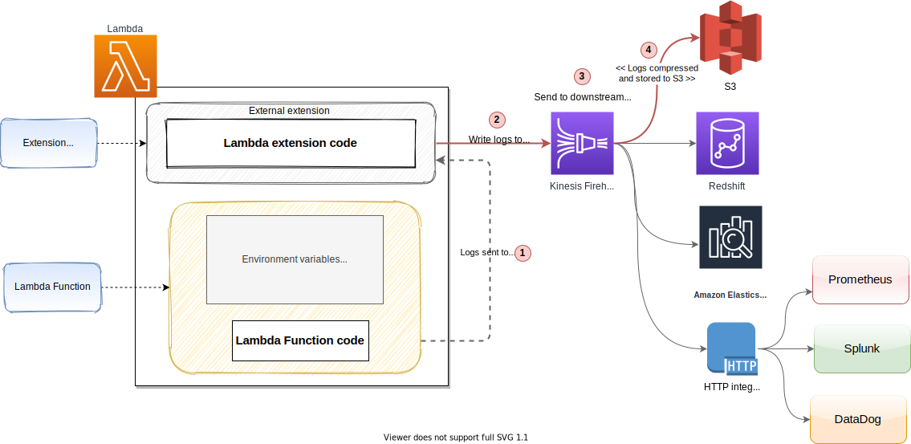
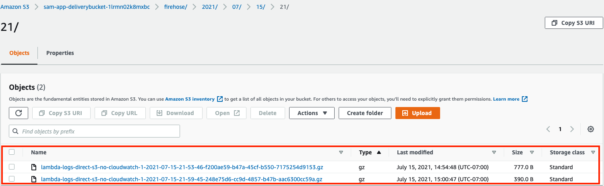
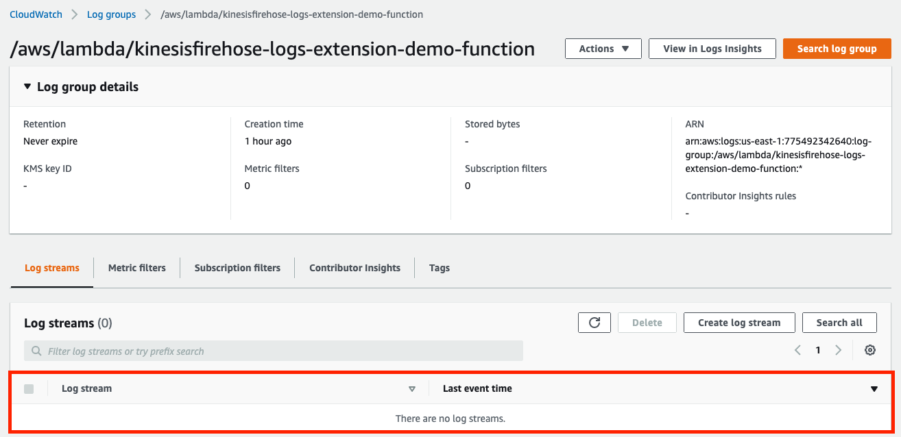

# Centralize log collection with Amazon Kinesis Data Firehose using Lambda Extensions

## Introduction

This pattern walks through an approach to centralize log collection for Lambda function with Kinesis firehose using external extensions. The provided code sample shows how to get send logs directly to Kinesis firehose without sending them to AWS CloudWatch service.

> Note: This is a simple example extension to help you investigate an approach to centralize the log aggregation. This example code is not production ready. Use it with your own discretion after testing thoroughly.

This sample extension:

* Subscribes to receive `platform` and `function` logs.
* Runs with a main, and a helper goroutine: The main goroutine registers to `ExtensionAPI` and process its `invoke` and `shutdown` events. The helper goroutine:
  * starts a local HTTP server at the provided port (default 1234, the port can be overridden with Lambda environment variable `HTTP_LOGS_LISTENER_PORT` ) that receives requests from Logs API with `NextEvent` method call
  * puts the logs in a synchronized queue (Producer) to be processed by the main goroutine (Consumer)
* The main goroutine writes the received logs to Amazon Kinesis firehose, which gets stored in Amazon S3

## Amazon Kinesis Data firehose

Amazon Kinesis Data Firehose is the easiest way to reliably load streaming data into data lakes, data stores, and analytics services. It can capture, transform, and deliver streaming data to Amazon S3, Amazon Redshift, Amazon Elasticsearch Service, generic HTTP endpoints, and service providers like Datadog, New Relic, MongoDB, and Splunk, read more about it [here](https://aws.amazon.com/kinesis/data-firehose)

> Note: The code sample provided part of this pattern delivers logs from Kinesis firehose to Amazon S3

## Lambda extensions

Lambda Extensions, a new way to easily integrate Lambda with your favorite monitoring, observability, security, and governance tools. Extensions are a new way for tools to integrate deeply into the Lambda environment. There is no complex installation or configuration, and this simplified experience makes it easier for you to use your preferred tools across your application portfolio today. You can use extensions for use-cases such as:

* capturing diagnostic information before, during, and after function invocation
* automatically instrumenting your code without needing code changes
* fetching configuration settings or secrets before the function invocation
* detecting and alerting on function activity through hardened security agents, which can run as separate processes from the function

read more about it [here](https://aws.amazon.com/blogs/compute/introducing-aws-lambda-extensions-in-preview/)

> Note: The code sample provided part of this pattern uses **external** extension to listen to log events from the Lambda function

## Need to centralize log collection

Having a centralized log collecting mechanism using Kinesis firehose provides the following benefits:

* Helps to collect logs from different sources in one place. Even though the sample provided sends logs from Lambda, log routers like `Fluentbit` and `Firelens` can send logs directly to Kinesis Data firehose from container orchestrators like `EKS` and `ECS`.
* Define and standardize the transformations before the log gets delivered to downstream systems like S3, elastic search, redshift, etc
* Provides a secure storage area for log data, before it gets written out to the disk. In the event of machine/application failure, we still have access to the logs emitted from the source machine/application

## Architecture

### AWS Services

* Amazon Lambda
* Amazon Lambda extension
* Amazon Kinesis Data Firehose
* Amazon S3

### High level architecture

Here is the high level view of all the components



Once deployed the overall flow looks like below:

* On start-up, the extension subscribes to receive logs for `Platform` and `Function` events.
* A local HTTP server is started inside the external extension which receives the logs.
* The extension also takes care of buffering the recieved log events in a synchronized queue and writing it to AWS Kinesis Firehose via direct `PUT` records

> Note: Firehose stream name gets specified as an environment variable (`AWS_KINESIS_STREAM_NAME`)

* The Lambda function won't be able to send any logs events to Amazon CloudWatch service due to the following explicit `DENY` policy:

```yaml
Sid: CloudWatchLogsDeny
Effect: Deny
Action:
  - logs:CreateLogGroup
  - logs:CreateLogStream
  - logs:PutLogEvents
Resource: arn:aws:logs:*:*:*
```

* The Kinesis Firehose stream configured part of this sample sends log directly to `AWS S3` (gzip compressed).

## Build and Deploy

AWS SAM template available part of the root directory can be used for deploying the sample lambda function with this extension

### Pre-requistes

* AWS SAM CLI needs to get installed, follow the [link](https://docs.aws.amazon.com/serverless-application-model/latest/developerguide/serverless-sam-cli-install.html) to learn how to install them

### Build

Check out the code by running the following command:

```bash
mkdir aws-lambda-extensions && cd aws-lambda-extensions
git clone https://github.com/aws-samples/aws-lambda-extensions.git .
cd kinesisfirehose-logs-extension-demo
```

Run the following command from the root directory

```bash
sam build
```

**Output**

```bash
Building codeuri: /Users/xxx/CodeBase/aws-lambda-extensions/kinesisfirehose-logs-extension-demo/hello-world runtime: nodejs12.x metadata: {} functions: ['HelloWorldFunction']
Running NodejsNpmBuilder:NpmPack
Running NodejsNpmBuilder:CopyNpmrc
Running NodejsNpmBuilder:CopySource
Running NodejsNpmBuilder:NpmInstall
Running NodejsNpmBuilder:CleanUpNpmrc
Building layer 'KinesisFireHoseLogsApiExtensionLayer'
Running CustomMakeBuilder:CopySource
Running CustomMakeBuilder:MakeBuild
Current Artifacts Directory : /Users/xxx/CodeBase/aws-lambda-extensions/kinesisfirehose-logs-extension-demo/.aws-sam/build/KinesisFireHoseLogsApiExtensionLayer

Build Succeeded

Built Artifacts  : .aws-sam/build
Built Template   : .aws-sam/build/template.yaml

Commands you can use next
=========================
[*] Invoke Function: sam local invoke
[*] Deploy: sam deploy --guided
```

### Deployment

Run the following command to deploy the sample Lambda function with the extension

```bash
sam deploy --guided
```

The following parameters can be customized part of the deployment

| Parameter  | Description | Default |
| ------------- | ------------- | ----|
| FirehoseStreamName  | Firehose stream name |  lambda-logs-direct-s3-no-cloudwatch |
| FirehoseS3Prefix  | The S3 Key prefix for Kinesis Firehose |  lambda-logs-direct-s3-no-cloudwatch |
| FirehoseCompressionFormat  | Compression format used by Kinesis Firehose, allowed value - `UNCOMPRESSED, GZIP, Snappy` |  GZIP |
| FirehoseBufferingInterval  | How long Firehose will wait before writing a new batch into S3 |  60 |
| FirehoseBufferingSize  | Maximum batch size in MB |  10 |

> Note: We can either customize the parameters, or leave it as default to proceed with the deployment

**Output**

```bash
CloudFormation outputs from deployed stack
-------------------------------------------------------------------------------------------------------------------
Outputs
-------------------------------------------------------------------------------------------------------------------
Key                 KinesisFireHoseLogsApiExtensionLayer
Description         Kinesis Log emiter Lambda Extension Layer Version ARN
Value               arn:aws:lambda:us-east-1:xxx:layer:kinesisfirehose-logs-extension-demo:5

Key                 BucketName
Description         The bucket where data will be stored
Value               sam-app-deliverybucket-xxxx

Key                 KinesisFireHoseIamRole
Description         Kinesis firehose IAM role
Value               arn:aws:firehose:us-east-1:xxx:deliverystream/lambda-logs-direct-s3-no-cloudwatch

Key                 HelloWorldFunction
Description         First Lambda Function ARN
Value               arn:aws:lambda:us-east-1:xxx:function:kinesisfirehose-logs-extension-demo-function
-------------------------------------------------------------------------------------------------------------------
```

## Testing

You can invoke the Lambda function using the following CLI command

```bash
aws lambda invoke \
    --function-name "<<function-name>>" \
    --payload '{"payload": "hello"}' /tmp/invoke-result \
    --cli-binary-format raw-in-base64-out \
    --log-type Tail
```

>Note: Make sure to replace `function-name` with the actual Lambda function name

The function should return ```"StatusCode": 200```, with the below output

```bash
{
    "StatusCode": 200,
    "LogResult": "<<Encoded>>",
    "ExecutedVersion": "$LATEST"
}
```

In a few minutes after the successful invocation of the Lambda function, we should start seeing the log messages from the example extension sent to Amazon Data Firehose which sends the messages to a Amazon S3 bucket.

* Login to AWS console:
  * Navigate to the S3 bucket mentioned under the parameter `BucketName` in the SAM output.
  * We can see the logs successfully written to the S3 bucket, partitioned based on date in `GZIP` format.
  
  
  * Navigate to `"/aws/lambda/${functionname}"` log group inside AWS CloudWatch service.
  * We shouldn't see any logs created under this log group as we have denied access to write any logs from the Lambda function.
  

## Cleanup

Run the following command to delete the stack, use the correct stack names if you have changed them during sam deploy

```bash
aws cloudformation delete-stack --stack-name sam-app
```  

## Resources

* [Using AWS Lambda extensions to send logs to custom destinations](https://aws.amazon.com/blogs/compute/using-aws-lambda-extensions-to-send-logs-to-custom-destinations/)
* [Ingest streaming data into Amazon Elasticsearch Service within the privacy of your VPC with Amazon Kinesis Data Firehose](https://aws.amazon.com/blogs/big-data/ingest-streaming-data-into-amazon-elasticsearch-service-within-the-privacy-of-your-vpc-with-amazon-kinesis-data-firehose/)
* [Example Logs API Extension in Go](https://github.com/aws-samples/aws-lambda-extensions/tree/main/go-example-logs-api-extension).

## Conclusion

This extension provides an approach to streamline and centralize log collection using Kinesis firehose.
