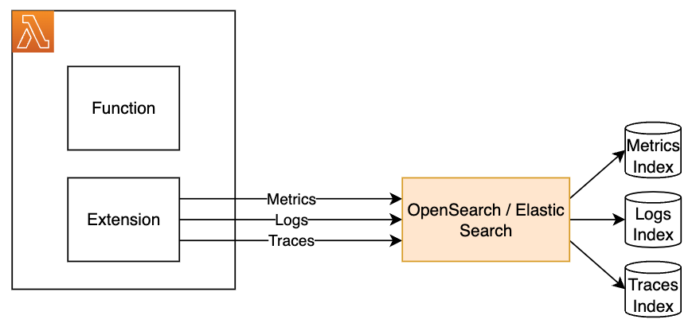

# Example Lambda Telemetry Integrations for OpenSearch

## Purpose

Customers often use third party tools to collect logs, metrics, and event data on their resources in AWS.  The Lambda Telemetry API offers the ability to send data directly from a Lambda extension to the customer's monitoring tool, rather than forcing them to pull the data from CloudWatch, so they can get more real-time data on the health and performance of their Lambda functions.

One of the most common tools that customers use is OpenSearch.  This repository provides examples on how customers can integrate Lambda telemetry data with OpenSearch.

## Architecture

Telemetry data, function logs, and extension logs can be sent to OpenSearch to be ingested and stored in one or more indices.  Once the events are ingested they can be searched or visualized through the UI (Kibana).

Each index has a mapping which defines the format of the events in that index, including the JSON structure of the document that makes up the event.  When an OpenSearch index is created the mapping can be defined, or OpenSearch can infer the mapping based on the intial event.

In this example, the extension is writing to two different indices for function logs, extension logs, and telemetry data.  Since the format differs for various telemetry events, a mapping is defined that allows the format of the event to be dynamic so that all telemetry data can be stored in a single index.  Once the telemetry data is ingested into the index, dashboards can be created based on the telemetry data. 



The sample uses the OpenSearch client, which will open a connection and create the telemetry index if it does not exist in order to define the mapping.  Then, it will use the bulk API to send events to the appropriate index.

## Implementation

The examples are based on the [python_example_telemetry_api_extension from the aws-samples project](https://github.com/aws-samples/aws-lambda-extensions/tree/main/python-example-telemetry-api-extension/python_example_telemetry_api_extension).  The changes are in the telemetry_dispatcher.py file in each folder, where the dispatch_telmetery() function is triggered to dispatch the telemetry data to the specific target.

## Installation

This code is provided as an example, and it is recommended that you review the code and update it to meet the needs of your environment.

There are two major components to this sample:

* `./extensions/` - This directory should be extracted to `/opt/extensions` where the Lambda platform will scan for executables to launch extensions
* `./python-example-telemetry-opensearch-extension/` - This directory should be extracted to `/opt/python-example-telemetry-opensearch-extension`, which is referenced by the `./extensions/python-example-telemetry-opensearch-extension` executable and includes a Python executable along with all of its necessary dependencies.

Install the extension dependencies locally, which will be mounted along with the extension code.

```bash
chmod +x python-example-telemetry-opensearch-extension/extension.py 
pip3 install -r python-example-telemetry-opensearch-extension/requirements.txt -t ./python-example-telemetry-opensearch-extension/
```

Then, package and deploy the extension as a Lambda Layer by following the [instructions provided in the Lambda Telemetry Sample](https://github.com/aws-samples/aws-lambda-extensions/tree/main/python-example-telemetry-api-extension#layer-setup-process)


## Function Invocation and Extension Execution

Configure the extension by setting below environment variables in your Lambda Function.

* `DISPATCH_MIN_BATCH_SIZE` - Optimize dispatching telemetry by telling the dispatcher how many log events you want it to batch. On function invoke the telemetry will be dispatched to OpenSearch only if number of log events collected so far is greater than `DISPATCH_MIN_BATCH_SIZE`. On function shutdown the telemetry will be dispatched to OpenSearch regardless of how many log events were collected so far. 

* `URL` - The URL of the OpenSearch API where the telemetry data will be sent.  For security purposes, it is recommended that OpenSearch not be accessible over the public internet.  The Lambda function should be configured to connect to a VPC, with the proper routing and security groups in place to allow Lambda to connect to OpenSearch.

* `AUTH_SECRET` - The ARN of the Secrets Manager secret that contains credentials to use when sending data to opensearch.  This should have two keys: `username` and `password`

* `PLATFORM_INDEX`, `FUNCTION_INDEX`, and `EXTENSION_INDEX` - The names of the different OpenSearch indicies to be used to store the telemetry, function logs, and extention logs.

When using Secrets Manager to store the authentication information, the IAM Role for the Lambda function must have the `secretsmanager:GetSecretValue` permission for the specified Secrets Manager ARN.