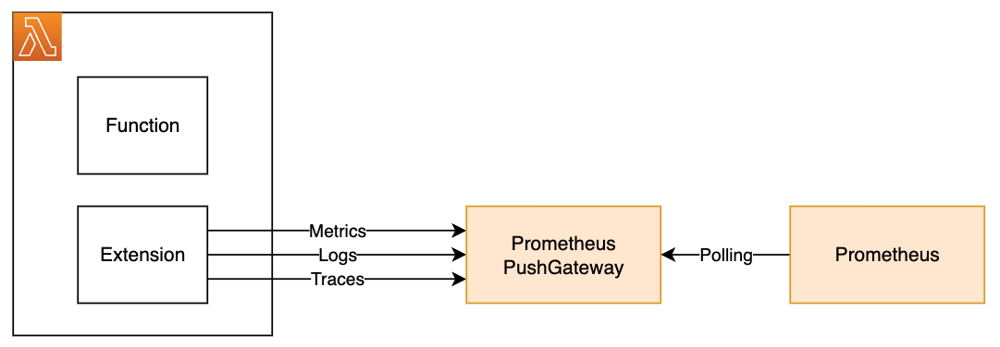

# Example Lambda Telemetry Integrations for Prometheus

## Purpose

Customers often use third party tools to collect logs, metrics, and event data on their resources in AWS.  The Lambda Telemetry API offers the ability to send data directly from a Lambda extension to the customer's monitoring tool, rather than forcing them to pull the data from CloudWatch, so they can get more real-time data on the health and performance of their Lambda functions.

One of the most common tools that is used to record telemetry data is Prometheus.  This repository provides examples on how the Lambda telemetry API can be integrated with Prometheus.

## Architecture

Prometheus uses a pull model for retrieving metrics.  Prometheus expects to be able to poll metrics at a regular interval, which works well for long running processes, but doesn't fit well with the lifecycle for Lambda functions.  To get around this, Prometheus has a [PushGateway](https://prometheus.io/docs/practices/pushing/), which is recommended for jobs that are not semantically related to a specific machine or job instance.  The Lambda function can push metrics to the PushGateway, which are then picked up by Prometheus.

Prometheus records metrics in a time series database, and supports multiple [metric types](https://prometheus.io/docs/concepts/metric_types/), such as Counters, Guages, Histograms, and Summaries.  Metrics can include labels to separate metrics that are from different sources.

For this example, the Python prometheus-client library is used to push metrics to a PushGateway.  The sample will parse the "platform.report" event to pull out metrics such as the duration and memory, and push that data to a PushGateway as Summary metrics.  It will also use Counters to track the number of each event type



## Implementation

The examples are based on the [python_example_telemetry_api_extension from the aws-samples project](https://github.com/aws-samples/aws-lambda-extensions/tree/main/python-example-telemetry-api-extension/python_example_telemetry_api_extension).  The majority of the changes are in the telemetry_dispatcher.py file, where the dispatch_telmetery() function is triggered to dispatch the telemetry data to the specific target.

## Installation

This code is provided as an example, and it is recommended that you review the code and update it to meet the needs of your environment.

There are two major components to this sample:

* `./extensions/` - This directory should be extracted to `/opt/extensions` where the Lambda platform will scan for executables to launch extensions
* `./python-example-telemetry-prometheus-extension/` - This directory should be extracted to `/opt/python-example-telemetry-prometheus-extension`, which is referenced by the `./extensions/python-example-telemetry-prometheus-extension` executable and includes a Python executable along with all of its necessary dependencies.

Install the extension dependencies locally, which will be mounted along with the extension code.

```bash
chmod +x python-example-telemetry-prometheus-extension/extension.py 
pip3 install -r python-example-telemetry-prometheus-extension/requirements.txt -t ./python-example-telemetry-prometheus-extension/
```

Then, package and deploy the extension as a Lambda Layer by following the [instructions provided in the Lambda Telemetry Sample](https://github.com/aws-samples/aws-lambda-extensions/tree/main/python-example-telemetry-api-extension#layer-setup-process)

## Encryption and Authentication

It is recommended that you secure traffic to the Prometheus and the PushGateway using HTTPS, and enable authentication.  See the [Prometheus Documentation](https://prometheus.io/docs/prometheus/latest/configuration/https/) for more information.  

It is also recommended that the PushGateway not be accessible over the public internet.  The Lambda function should be configured to connect to a VPC, with the proper routing and security groups in place to allow Lambda to connect to the PushGateway.

## Function Invocation and Extension Execution

Configure the extension by setting below environment variables in your Lambda Function.

* `DISPATCH_MIN_BATCH_SIZE` - Optimize dispatching telemetry by telling the dispatcher how many log events you want it to batch. On function invoke the telemetry will be dispatched to the PushGateway only if number of log events collected so far is greater than `DISPATCH_MIN_BATCH_SIZE`. On function shutdown the telemetry will be dispatched to the PushGateway regardless of how many log events were collected so far. 

* `GATEWAY` - The URL of the PushGateway

* `AUTH_SECRET` - The ARN of the Secrets Manager secret that contains credentials to use when sending data, assuming that basic authentication is enabled.  This should have two keys: `username` and `password`

When using Secrets Manager to store the authentication information, the IAM Role for the Lambda function must have the `secretsmanager:GetSecretValue` permission for the specified Secrets Manager ARN.