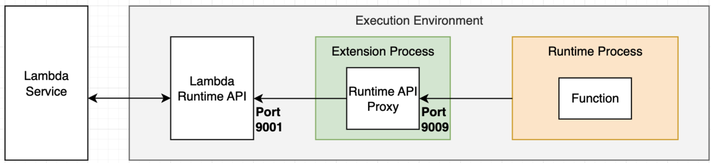

# Lambda Runtime API Proxy Extension - Rust

This repo contains a sample implementation of how to build a basic Lambda Runtime API Proxy extension with Rust 🦀.

> This is an example to help you start implementing the Lambda Runtime API Proxy pattern. This sample code is not production-ready. Use it at your own discretion, and always testing thoroughly.
>
> Read the full blog post describing this pattern [here](https://aws.amazon.com/blogs/compute/enhancing-runtime-security-and-governance-with-the-aws-lambda-runtime-api-proxy-extension/)

By implementing the Runtime API proxy pattern as part of your extension, you can hook into the function invocation request and response lifecycle. This allows you to use extensions for implementing advanced security, compliance, governance, and observability scenarios with zero changes to the function code. You can add runtime security mechanisms, such as application firewalls, implement audit procedures for data flowing in and out of the function, enhance observability by auto-injecting tracing headers, and more.

## Architecture

Lambda Runtimes use the `AWS_LAMBDA_RUNTIME_API` environment variable for making requests to the Runtime API. Two primary endpoints for the happy path scenario are `/next`, which is used to retrieve the next event to process, and `/response`, which is used to return event processing results to the Lambda service. In addition, the Lambda Runtime API also provides endpoints for reporting failures. See the full protocol and schema definitions of the Runtime API [here](https://docs.aws.amazon.com/lambda/latest/dg/runtimes-api.html).

The Runtime API Proxy is a component that hooks into the default workflow, and proxies requests and responses, allowing you to augment them and control the workflow along the path. This is illustrated in the following diagram.


## Sequence diagram

When Lambda service creates a new Execution Environment, it starts by initializing extensions attached to the function. The Execution Environment waits for all extensions to register by calling the Extensions API `/register` endpoint, and only then proceeds to initialize the Runtime. This allows you to start the Runtime API Proxy HTTP listener during extension initialization so it will be ready to serve Runtime requests. 

By default, the value of `AWS_LAMBDA_RUNTIME_API` environment variable in the Runtime process points to the Lambda Runtime API endpoint 127.0.0.1:9001. You can use a simple wrapper script to change that value to point to the Runtime API Proxy endpoint instead. You can add a wrapper script to your function by setting the `AWS_LAMBDA_EXEC_WRAPPER` environment variable. The following wrapper script assumes that the Runtime API Proxy is listening on port 9009.

```bash
#!/bin/bash
args=("$@")
export AWS_LAMBDA_RUNTIME_API="127.0.0.1:9009"
exec "${args[@]}"
```

You can either add the above export line to the existing wrapper script or create a new one. Read more about using wrapper scripts [here](https://docs.aws.amazon.com/lambda/latest/dg/runtimes-modify.html#runtime-wrapper). 



After following the above steps, the Runtime API Proxy will be bootstrapped by the Lambda service when a new Execution Environment is created and will be ready to proxy requests from the Runtime to Runtime API by the first invocation. The only thing left to do is to implement the proxy logic.


We recommend you implement extensions using a programming language that can be compiled to a binary executable, such as Golang or Rust. This will allow your extension to be usable with any Lambda Runtime. Extensions implemented in interpreted languages, such as JavaScript and Python, or languages that require additional virtual machines, such as Java and C#, will only be usable with that specific runtime. Sample implementations in JavaScript, Golang, and Rust are available at http://github.com/aws-samples/tbd.

## Considerations

Runtime API Proxy allows you to hook into the Lambda request/response workflow, enabling new use cases in security and observability space. However, there are several important considerations when using it.

* This is a technically advanced approach that will require you to have a good understanding of Lambda Execution environment lifecycle and Runtime API specifics. You will need to implement proxying for all the endpoints provided by the Runtime API, as well as handle runtime failures. 
* You should prepare your extension for composability, and always assume there might be more than one extension implementing the Runtime API Proxy pattern. Allow your extension consumers to configure the extension via environment variables using at least two parameters - the port your extension listens on and the Runtime API endpoint your extension connects to. The latter should default to the original value of `AWS_LAMBDA_RUNTIME_API` environment variable.  See the sample implementation for details. 
* Using this approach with default buffered responses is straightforward, however it will require additional effort to support functions with response streaming. 
* Proxying API requests adds latency. The added overhead depends on your implementation. We recommend using programming languages that can be compiled to executable binary, such as Rust and Golang, and keeping your extensions as lightweight and efficient as possible.

## 🏗️ Building the package

This package uses  *Make* to build binary executables for *aarch64* and *x86_64* using `cargo cross`.

**Targets**: `x86_64-unknown-linux-gnu` for x86_64 Lambdas and `aarch64-unknown-linux-gnu` for Gravaton-based Lambdas (64-bit ARM) with GNU **libc**.

### Dependencies 

* Make tools
* Rust standard: https://www.rust-lang.org/tools/install (tested with 1.72)
* Cargo cross (~0.2.5)
  * cross-compiling to different targets; Docker or podman based
  * Install with `cargo install cross`
  * Example usage: `cross build --release --target x86_64-unknown-linux-gnu`
* `zip` tool
* `aws` CLI tool 
* `jq` JSON manipulation tool

### Building and Deploying the Extension Layer

With the dependencies installed, run `make` in the base directory 
to compile the binaries.  The executables and  are copied into `build/`. The extension entrypoint script (`opt/entrypoint`) is copied to `build/extensions/lrap`

Run `make deploy` to publish the Lambda Layer (named _lrap_ in the *Makefile*) using the build *zip*-file. Make uses the AWS commandlie utility, which uses credentials stored in `ENV['AWS_*']` or `~/.aws/credentials`.

### Using the Extension with a Lambda Function

1. Modify *rust-example-lambda-runtime-api-proxy-extension* source
2. Run `make` to rebuild and publish the Lambda Layer
3. Update the Lambda Function Layers by running:

    ```
    aws lambda update-function-configuration \
        --function-name <name> \
        --layers <layer ARN with version printed in step 2>
    ```

4. Ensure that the Lambda Function has `AWS_LAMBDA_EXEC_WRAPPER=/opt/wrapper` environment variable set
5. Invoke the Lambda Function

If you test locally with containers, you can mount `build/` as a volume bound to `/opt` in the container.

## Useful links

* [AWS Lambda Extension API docs](https://docs.aws.amazon.com/lambda/latest/dg/runtimes-extensions-api.html)
* [Introducing Lambda Extensions blog](https://aws.amazon.com/blogs/compute/introducing-aws-lambda-extensions-in-preview/)
* [AWS Lambda Extensions GA blog](https://aws.amazon.com/blogs/aws/getting-started-with-using-your-favorite-operational-tools-on-aws-lambda-extensions-are-now-generally-available/)
* [Lambda Extensions Deep-Dive video series](https://www.youtube.com/playlist?list=PLJo-rJlep0ECO8od7NRdfJ4OrnQ7TMAwj)
* [AWS Lambda Extensions github.com samples](https://github.com/aws-samples/aws-lambda-extensions)
