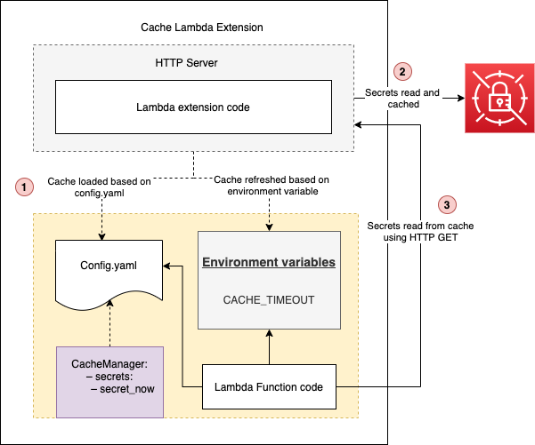
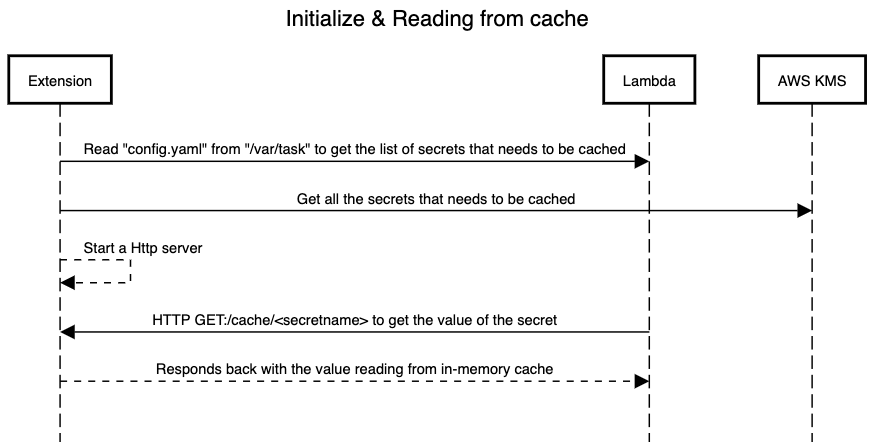

# Secrets Cache Lambda Extension
This extension demonstrates how to host an HTTP server which cache secrets required for the lambda function. The extension does the following:
- Hosts a local HTTP server, which will be invoked by lambda function to retrieve the secret instead of directly going to AWS Secret manager
- The extension using config.yaml file inside the Lambda to get the list of secrets that needs to get cached in memory
- Secrets cache is refreshed based on the value (in minutes) set in the environment variable "CACHE_TIMEOUT". If no value is specified its defaulted to 10

> Note: This extension requires the Node.js 12 runtime to be present in the Lambda execution environment of your function.

## Overview
Here is the high level view of all the components



## Initializing extension and reading secrets from the cache
Below sequence diagram explains the initialization of lambda extension and how lambda function
reads cached secrets using HTTP server hosted inside the extension 


## Pre-requisites
- NodeJS runtime should be installed in the local system, for more information click [here](https://nodejs.org/en/download/)
- Zip utility needs to be installed in the local system
- AWS CLI needs to be installed in the local system, for more information click [here](https://docs.aws.amazon.com/cli/latest/userguide/cli-chap-install.html)

## Deploy
### Secrets manager
- Create a new secret using the following command
> Note: This command assumes you've placed your secret, such as this example JSON text structure {"username":"anika","password":"aDM4N3*!8TT"}, in a file named mycreds.json.

```bash
aws secretsmanager create-secret --name secret_now --secret-string file://mycreds.json
```

### Lambda function
- Create a new NodeJS runtime Lambda function with the name "Secrets-Extension-Lambda-Test"
- After successfully creation of Lambda, attach "SecretsManagerReadWrite" policy to the IAM role associated with the Lambda function
- Replace the code inside "index.js" with the following
> Note: Sample of the below code can be found in "example-function/index.js" under the code repo

```javascript
exports.handler = function(event, context, callback) {

    const https = require('http')
    const options = {
        hostname: 'localhost',
        port: 8080,
        path: '/cache/secret_now',
        method: 'GET'
    }

    const req = https.request(options, res => {
        res.on('data', d => {
            console.log("Response from cache: "+d);
            return d;
        })
    })

    req.on('error', error => {
        console.error(error)
    })

    req.end()
};
```
> Note: The code invokes the local HTTP server hosted inside lambda extension to read the secret's value instead 
> of directly going to AWS Secret's manager

- Create a new file named "config.yaml" under the root directory with the following contents:
> Note: Sample of the below yaml file can be found in "example-function/config.yaml" under the code repo. "secret_now" is the name of the secret we have created in the previous step, and we want to be cached by the extension. 
> If you want more secrets to be cached you can keep adding them here

```bash
SecretManagers:
 – secrets:
    – secret_now
 ```

- Click on "Deploy" button to deploy the latest changes
- Create a new environment variable "CACHE_TIMEOUT" and set the value in minutes based on which the cache will be 
refreshed
> Note: If the environment value not found, then cache gets refreshed every 10 minutes

- Increase the memory of Lambda to 1200 MB & Timeout to 30 seconds

### Deploy extension
- Run the following command to deploy the extension and associate the layer to the Lambda function
```bash
> chmod +x deploy.sh
> ./deploy.sh
```

### Invoke Lambda function
You can invoke the Lambda function using the following CLI command
```bash
aws lambda invoke \
 --function-name "Secrets-Extension-Lambda-Test" \
 --payload '{"payload": "hello"}' /tmp/invoke-result \
 --cli-binary-format raw-in-base64-out \
 --log-type Tail
```

The function should return ```"StatusCode": 200```.

### View logs
Browse to the Amazon CloudWatch Console. Navigate to Logs\Log Groups. Select the log group /aws/lambda/Secrets-Extension-Lambda-Test.

View the log stream to see the runtime log with pattern ```"Response from cache"``` followed by username and password stored in 
```mycred.json```
